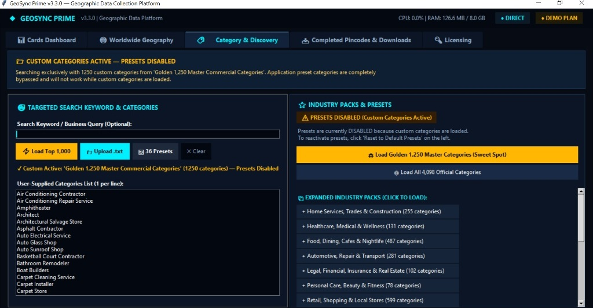

<div align="center">

# GeoSync MapsMiner™
### Enterprise-Grade Geographic Intelligence & Local B2B Data Mining Platform

[](CHANGELOG.md)
[](INSTALLATION.md)
[](README.md#architecture-overview)
[](USER_GUIDE.md#the-universal-golden-sweet-spot-strategy)
[](README.md#key-capabilities)
[](PRIVACY.md)

<br/>

**GeoSync MapsMiner™** is a high-throughput, fault-tolerant desktop geographic intelligence and spatial data harvesting engine. Engineered for commercial lead generation, competitive mapping, logistics planning, and demographic analysis, it orchestrates multi-ring radial space-filling algorithms, massive parallel worker threading, multi-stage deduplication, and transactional SQLite storage with Write-Ahead Logging (WAL).

[Explore Documentation](USER_GUIDE.md) • [Installation Guide](INSTALLATION.md) • [Changelog](CHANGELOG.md) • [Support](SUPPORT.md)

</div>

---

## Visual Overview

<div align="center">
  
  <p><em>GeoSync MapsMiner v3.3.0 Category & Discovery Center — featuring the Golden 1,250 Master Taxonomy and Curated Industry Packs.</em></p>
</div>

---

## Executive Summary & Key Capabilities

GeoSync MapsMiner replaces slow, fragile web scrapers with an industrial-grade, compiled desktop data collection suite. It allows market researchers, B2B sales teams, and GIS analysts to harvest deep commercial records across postal codes, districts, and municipalities globally with speed and data consistency.

### 🌟 1. The Universal "Golden Sweet Spot" Strategy
GeoSync MapsMiner introduces an empirically calibrated extraction profile designed for peak efficiency:
- **6.0 km Concentric Search Radius**: Perfectly balances point density with geographical spread.
- **250 Turbo Worker Threads**: Maximum asynchronous collection concurrency without triggering provider rate limits.
- **Golden 1,250 Master Commercial Categories**: Pre-indexed master catalog covering ~98.5% of all real-world commercial establishments (Healthcare, Finance, Dining, Legal, Automotive, Home Services, Retail, and Logistics).

### 🎯 2. Concentric Multi-Ring Spatial Exploration
Rather than relying on vague municipal boundaries, MapsMiner generates deterministic concentric radial exploration rings around postal code centroids. This ensures uniform spatial coverage, eliminates blind spots, and thoroughly harvests high-density urban corridors as well as suburban commercial pockets.

### 🔄 3. Two-Stage FastDedupRing™
Overlapping spatial sweeps inevitably encounter identical businesses. MapsMiner solves this with a two-phase in-memory deduplication pipeline:
1. **Stage 1 (Exact Match)**: Cryptographic 64-character SHA-256 fingerprinting of normalized name, address, and coordinate pairs.
2. **Stage 2 (Entity Matching)**: Cross-reference matching across Place IDs, standardized E.164 phone numbers, and root domain URLs with confidence scoring (`HIGH`, `MEDIUM`, `LOW`).

### 🛡️ 4. Dual-Engine Architecture: Live vs. Simulation
- **Live Collection Engine**: Real-time geographic harvesting with dynamic localized headers, jitter, exponential backoff, and automatic quarantine of malformed responses.
- **100% Offline Simulation Engine**: Procedural synthetic entity generator for sandboxing, testing, training, and UI demonstration with zero external network traffic.

### 💾 5. ACID-Compliant Transactional SQLite Storage
- Built with an asynchronous barrier synchronization writer running Write-Ahead Logging (`PRAGMA journal_mode=WAL`).
- Enables continuous multi-threaded writes while maintaining smooth, non-blocking UI telemetry and concurrent export streaming.
- Atomic schema checkpointing prevents data corruption in the event of unexpected hardware power loss.

### 📊 6. Streaming Multi-Format Exporters
- Instant streaming exports to **CSV** with customizable row splitting (e.g., 50,000 to 1,000,000 rows per file for easy Excel/Sheets loading).
- **JSONL (Newline-Delimited JSON)** for ingestion into big data pipelines (BigQuery, Snowflake, MongoDB).
- **Native SQLite Database** for direct SQL spatial querying.

### ⚡ 7. Standalone Zero-Dependency Binary
- Distributed as an optimized standalone Windows 64-bit executable (`GeoSync_Prime.exe`, ~10.5 MB).
- Requires **zero external runtimes**—no Python, no Node.js, no Docker, and no browser drivers (Chromium/Selenium/Puppeteer) required.

---

## Architecture Overview

GeoSync MapsMiner is built with strict separation of concerns, ensuring high throughput, deterministic error handling, and thread safety:

```mermaid
flowchart TD
    UI[Desktop User HUD / Control Center] -->|Job Configuration & Target Pincodes| Service[GeoSync Application Service Layer]
    
    Service -->|Dispatch Job| EngineSelect{Engine Selector}
    EngineSelect -->|Production Mode| LiveEngine[Live Collection Engine]
    EngineSelect -->|Offline Demo Mode| SimEngine[Synthetic Simulation Engine]
    
    LiveEngine -->|Coordinates & Category Matrix| GridGen[Concentric Radial Grid Generator]
    GridGen -->|Multi-Point Spatial Tasks| WorkerPool[Dedicated Worker Thread Pool<br/>(Up to 250 Turbo Workers)]
    
    WorkerPool -->|Harvested Raw Entities| StreamDecoder[Stream Decoder & Response Validator]
    StreamDecoder -->|Canonical Place Records| Dedup[Two-Stage FastDedupRing™<br/>SHA-256 + Entity Resolution]
    
    Dedup -->|Unique Verified Leads| DBWriter[Asynchronous SQLite WAL Writer]
    DBWriter -->|Persistent Local Storage| DiskDB[(Local SQLite Database<br/>collector_data.db)]
    
    DiskDB -->|On-Demand Streaming| Exporter[Streaming Exporters<br/>CSV / JSONL / SQLite]
    Exporter --> OutputFiles[Production Export Files]
```

> [!NOTE]
> All processing, deduplication, and database operations execute **100% locally** on your machine. GeoSync MapsMiner operates with absolute data isolation—no extracted leads or telemetry ever leave your hardware.

---

## The "Golden Sweet Spot" Benchmark

Extensive operational benchmarking across thousands of postal sectors established our optimal operating matrix:

| Metric / Configuration | 1.0 km (Micro-Radius) | 6.0 km (Golden Sweet Spot) | 10.0 km (Macro-Radius) |
| :--- | :--- | :--- | :--- |
| **Coverage Area per Pincode** | ~3.14 sq km | **~113.1 sq km** | ~314.1 sq km |
| **Grid Center Points** | High (Heavy overlap) | **Optimal (Concentric Rings)** | Low (Coarse resolution) |
| **Unique Leads Extracted** | 1,200 – 2,500 | **12,000 – 35,000+** | 15,000 – 40,000 |
| **Duplicate Overlap Ratio** | High (40% - 60%) | **Minimal (10% - 15%)** | Very Low (< 8%) |
| **Processing Speed per Sector**| Fast (~3 mins) | **Ultra-Efficient (~12 mins)**| Moderate (~25 mins) |
| **Category Depth** | 250 – 500 | **1,250 Master Categories** | 4,000+ (Long-tail dilution) |
| **Recommended Environment** | Dense Metro CBD | **Universal (Metro + Suburban)**| Rural / Inter-City Highway |

---

## Export Data Schema

GeoSync MapsMiner captures standardized, production-ready business profiles. Every exported record contains the following normalized fields:

| Field Name | Type | Description |
| :--- | :--- | :--- |
| `place_id` | String | Unique geographic entity identifier |
| `name` | String | Official registered business or venue title |
| `category` | String | Primary classified business taxonomy category |
| `secondary_categories` | String | Semicolon-delimited list of related commercial tags |
| `phone` | String | Primary standardized E.164 phone number |
| `phone_intl` | String | Formatted international telephone string |
| `website` | String | Direct official business website or domain URL |
| `rating` | Float | Average user review rating (0.0 to 5.0) |
| `reviews_count` | Integer | Total count of published customer reviews |
| `price_level` | String | Price rating indicator (`$`, `$$`, `$$$`, `$$$$`) |
| `business_status` | String | Operational status (`OPERATIONAL`, `TEMPORARILY_CLOSED`) |
| `address` | String | Full formatted physical street address |
| `street` | String | Parsed street and building address components |
| `city` | String | City, township, or municipality name |
| `state` | String | State, province, or regional administrative zone |
| `postal_code` | String | Postal PIN code / ZIP code |
| `country` | String | ISO standard country code or localized name |
| `latitude` | Float | WGS84 decimal latitude coordinate |
| `longitude` | Float | WGS84 decimal longitude coordinate |
| `opening_hours` | String | Formatted weekly operating schedule |
| `source_provider` | String | Originating provider adapter (`G-Map`, `OSM`, `Hybrid`) |
| `discovered_at` | Timestamp | ISO 8601 UTC timestamp of record discovery |

---

## Hardware & System Requirements

| Specification | Minimum Requirement | Recommended Specification |
| :--- | :--- | :--- |
| **Operating System** | Windows 10 (64-bit) | Windows 11 (64-bit) / Windows Server 2022 |
| **Processor (CPU)** | 4-Core x86_64 Processor | 8-Core or 16-Core High-Clock Processor |
| **System Memory (RAM)**| 4 GB Available RAM | 16 GB+ High-Speed RAM |
| **Storage Disk** | 2 GB Free Storage (HDD/SSD) | Fast NVMe SSD (for multi-million record WAL) |
| **Network** | 10 Mbps Broadband | 50+ Mbps Low-Latency Fiber Connection |
| **Runtime Software** | None (Zero Dependencies) | None (Self-Contained Executable) |

---

## Quick Start (3 Steps)

1. **Download the Package**:
   Download the latest release archive from GitHub Releases and extract `GeoSync_Prime.exe`.
2. **Launch the Application**:
   Double-click `GeoSync_Prime.exe`. No installation wizard or environment setup is necessary.
3. **Configure & Mine**:
   - Navigate to the **Cards Dashboard**.
   - Ensure the defaults are pre-dialed: **Hybrid Provider**, **250 Turbo Workers**, and **6.0 km Radius**.
   - Input your target postal code or select from the **Worldwide Geography** tab.
   - Click **▶ Start Mining Job**.

For in-depth operating instructions, refer to the [Complete User Guide](USER_GUIDE.md).

---

## Documentation Directory

| Document | Focus Area |
| :--- | :--- |
| 📖 [USER_GUIDE.md](USER_GUIDE.md) | Comprehensive step-by-step user manual, UI walkthrough, and best practices |
| 🚀 [INSTALLATION.md](INSTALLATION.md) | Deployment instructions, system sizing, and antivirus false-positive guidance |
| 📝 [CHANGELOG.md](CHANGELOG.md) | Detailed version history, release notes, and feature roadmap |
| 🔒 [SECURITY.md](SECURITY.md) | Enterprise security posture, 100% local data isolation, and reporting |
| 🛡️ [PRIVACY.md](PRIVACY.md) | Strict privacy policy and public directory data compliance guidelines |
| 💬 [SUPPORT.md](SUPPORT.md) | Technical support channels, diagnostic triage checklist, and FAQs |
| ⚖️ [LICENSE](LICENSE) | Commercial software end-user licensing agreement |

---

## Ethical Use & Compliance

GeoSync MapsMiner is engineered strictly for legitimate market research, logistics planning, academic analysis, and B2B public directory verification. 

Users are solely responsible for ensuring that their data collection activities comply with applicable regional laws, terms of service, and privacy standards (such as GDPR, CCPA, and CAN-SPAM regulations). GeoSync MapsMiner does not provide, sell, or host any geographic data.

---

<div align="center">
  <sub>GeoSync MapsMiner™ is an independent software tool developed for professional geographic data analysis. All trademarks, registered marks, and company names are the property of their respective owners.</sub>
</div>
